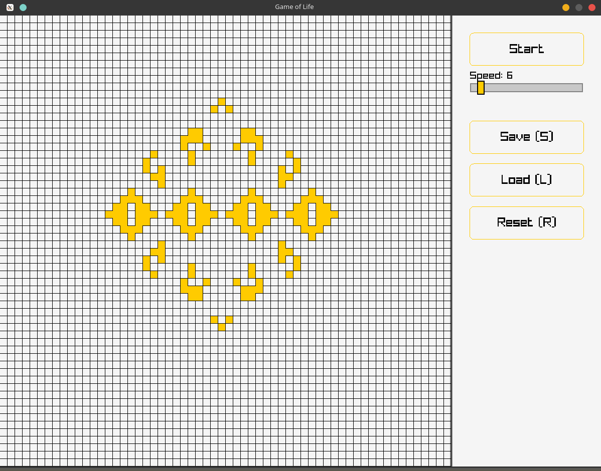

# 🎮 Conway's Game of Life - Raylib C++

Une implémentation interactive et moderne du célèbre automate cellulaire **Jeu de la Vie** de John Conway, développée en C++ avec la bibliothèque graphique Raylib.

*Capturez une image de votre jeu en action et nommez-la `screenshot.png`*

## ✨ Fonctionnalités

- 🖱️ **Dessin interactif** : Dessinez avec le clic gauche, effacez avec le clic droit
- ⏸️ **Contrôles de simulation** : Lecture/Pause avec bouton ou barre d'espace
- ⚡ **Vitesse ajustable** : Slider pour contrôler la vitesse de simulation (1-60 FPS)
- 💾 **Sauvegarde/Chargement** : Sauvegardez vos motifs favoris (touches S/L)
- 🔄 **Réinitialisation** : Effacez la grille en un clic (touche R)
- 📱 **Interface responsive** : S'adapte automatiquement à votre résolution d'écran
- 🎨 **Interface moderne** : Design épuré avec code couleur (or/noir)

## 🎯 Règles du Jeu de la Vie

1. Une cellule vivante avec **moins de 2 voisins** meurt (sous-population)
2. Une cellule vivante avec **2 ou 3 voisins** survit
3. Une cellule vivante avec **plus de 3 voisins** meurt (surpopulation)
4. Une cellule morte avec **exactement 3 voisins** devient vivante (reproduction)

## 🕹️ Commandes

| Action | Contrôle |
|--------|----------|
| Dessiner une cellule | Clic gauche (maintenir) |
| Effacer une cellule | Clic droit (maintenir) |
| Pause/Lecture | Barre d'espace ou bouton |
| Sauvegarder motif | Touche `S` ou bouton Save |
| Charger motif | Touche `L` ou bouton Load |
| Réinitialiser grille | Touche `R` ou bouton Reset |
| Ajuster vitesse | Slider de vitesse |

## 🚀 Installation et Compilation

### Prérequis

- **C++ Compiler** (GCC, Clang, MSVC)
- **CMake** 3.11+ (recommandé) ou Make
- **Raylib** sera téléchargé automatiquement via CMake

### Option 1 : CMake (Recommandé)

